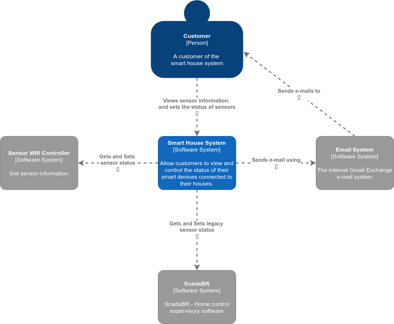
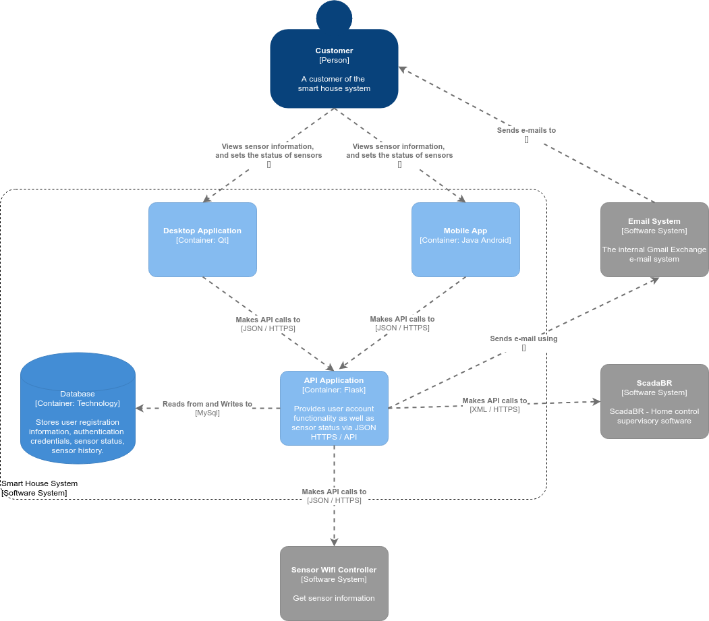
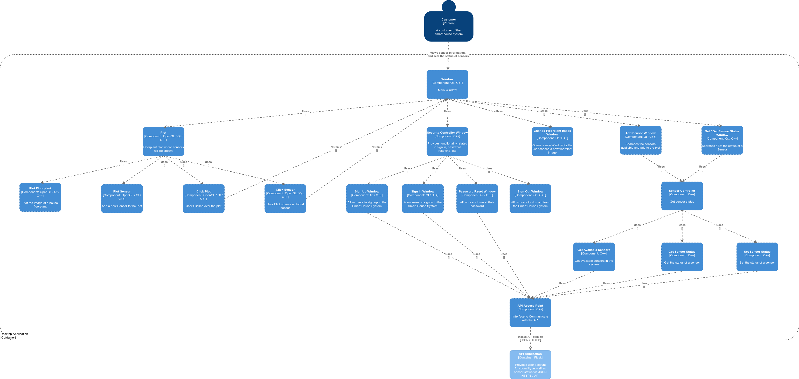
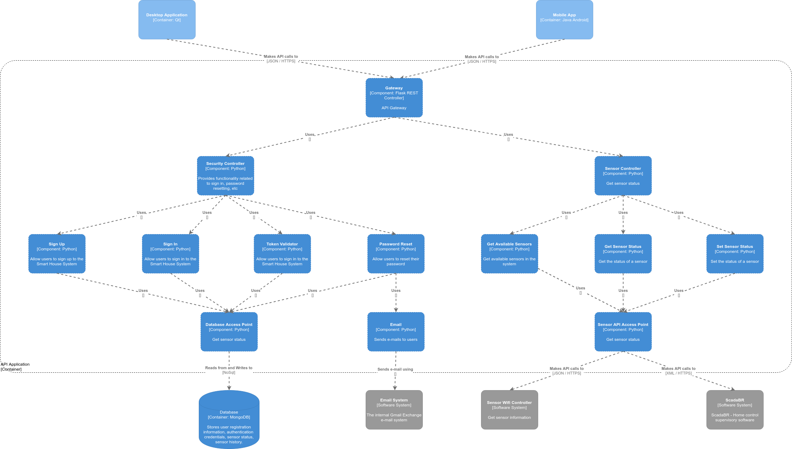
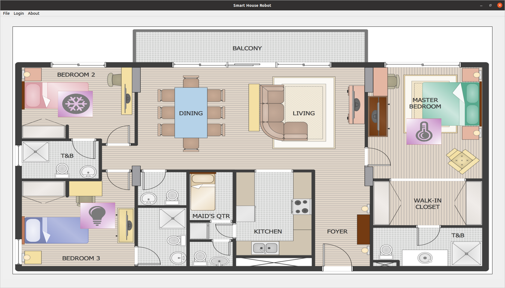
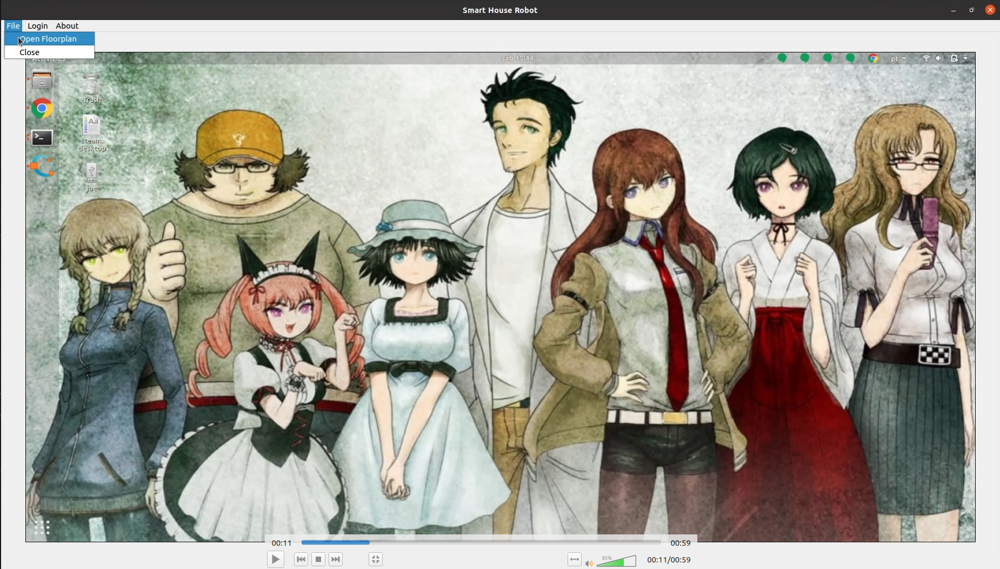

# Original project link:

The original host of this project is in Gitlab: https://gitlab.com/joe-stifler/mc426-smart-home-robot. Here, you can see all issues, epics, user histories, and merge requests.

# MC426 - Smart House

We will design software that updates in real time the status of the users smart devices (light bulb, water flow sensor, temperature sensor, etc). To facilitate the visualization, a 2D interface representing the house floorplant will be shown. In addition, pertinent information about the smart devices will be shown on the house plan (such as presence sensors, smart lights, etc.). The goal will be to offer a global view of the status of smart devices in the home as well as allowing the user to control them.
<hr>

# Table of Contents
* [Team Members](#team-members)
* [Project Achitecture](#project-architecture)
    * [Smart House Desktop Application](#smart-house-desktop)
    * [Smart House Mobile Application](#smart-house-mobile)
    * [Smart House System API](#smart-house-api)
* [Architectural Styles Adopted](#architectural-styles)
* [Project Patterns Adopted](#project-patterns)
* [Installation](#install)
    * [API Application](#install-api-app)
    * [Desktop Application](#install-desktop-app)
* [Usage](#usage)
    * [API Application](#usage-api-app)
    * [Desktop Application](#usage-desktop-app)
* [Screenshot of the Desktop Application](#desktop-screenshot)
* [Demo Video Desktop Application](#demo-vide-desktop)


# <a name="team-members"></a>Team Members
Gabriel Francioli Alves

* RA: 172111
* Email: <g172111@dac.unicamp.br>

Gabriel Sudo Enoki

* RA: 172503
* Email: <g172503@dac.unicamp.br>

José Ribeiro Neto

* RA: 176665
* Email: <j176665@dac.unicamp.br>

Wallace da Cruz Pereira	

* RA: 188601
* Email: <w188601@dac.unicamp.br>

# <a name="project-architecture"></a>Project Architecture

### C4 Diagram - Level 1: Context

In the context diagram of our application, shown in the [Figure 1](#fig1) below, we can see that a Customer (user) can view and control the status of your smart devices (sensors) using a Smart House System. The Smart House System is just a more robust interface between the user and the real sensors, which are already controlled by a legacy (ScadaBR) and a Wifi Controller system.

<a name="fig1"></a>
<p align="center">
  
</p>
<center>Figure 1 - Context Diagram</center>


### C4 Diagram - Level 2: Containers

At first, we have a mobile application and a desktop application that make calls to an API Application, which controls the main components of the application (sign in, sign out, search of sensor status, etc). Then, such API application uses external software system to obtain the physical status of sensors  (from the Wifi Controller and the ScadaBR system), and to send informations to users (using the Email System). Such interactions are provided in the container diagram shown in [Figure 2](#fig2) below.

<a name="fig2"></a>
<p align="center">
  
</p>
<center>Figure 2 - Container Diagram</center>

### C4 Diagram - Level 3: Components

#### <a name="smart-house-desktop"></a>Smart House Desktop Application
[Figure 3](#fig3) shows the level 3 - component diagram of the Desktop application. In this diagram, an user access the Desktop interface through a Main Window GUI. The components of such desktop application are:

* **Main Window:** controls all the actions in the systems, such as sign in, sign out, sensor access information, plotting, etc

    * **Plot:** Handles 

        * **Plot Floorplant:** Plot in the Screen the image of a house floorplant.

        * **Plot Sensor:** Plot in the Screen the image of a Sensor.

        * **Click Plot:** Handle the click of a user over the floorplant plot and notifies the main window of such action.

        * **Click Sensor:** Handle the click of a user over some plotted sensor and notifies the main window of such action.

    * **Change Floorplant Image Window:** Gets an image selected by the user and send to the plotter component component to plot it. 

    * **Add Sensor Window:** Gets from the external API all available sensors, gets the selected sensor by the user, and send it to the plotter component to plot it. 

    * **Set / Get Sensor Status Window:** Gets user input about a sensor (ex, the new state of a light bulb) and send this value to the external API to change the status of a sensor.

    * **Sensor Controller:** Controls action related with the sensors.
        
        * **Get Available Sensors:** Get from the external API all the active sensors in the system.

        * **Get Sensor Status:** Get from the external API the status of a specific sensor.

        * **Set Sensor Status:** Set in the external API the status of a specific sensor.

    * **Security Controller Window:** controls and interfaces all actions involving sig in, sing out, password reset

        * **Sign Up Window:** Get Information from the user and creates a new user account using the external API.

        * **Sign In Window:** Get Login Information from the user and authenticate it using the external API.

        * **Password Reset Window:** Get Login Information from the user and reset the password of such user using the external API.

        * **Sign Out Window:** Clears all authentication data.

* **API Access Point:** allows the desktop application to access an external API to get user authentication and get / set the status of sensors.

<a name="fig3"></a>
<p align="center">
    
</p>
<center>Figure 3 - Desktop Component Diagram</center>

#### <a name="smart-house-mobile"></a>Smart House Mobile Application
Since we don't know if we will have available time to implement everything, we choose to not implement the mobile application. So, we will not provide its component diagram.


#### <a name="smart-house-api"></a>Smart House System API
[Figure 4](#fig4) shows the level 3 - component diagram of the API application. In this diagram, an external application requests to a gateway component access to informations about the internal system. 

* **Gateway:** Allow external users to access the internal system informations (sign up, sign in, sensor status, etc)

    * **Security Controller:** Allows all components to perform security procedures.

        * **Sign in Controller:** Controls and allows users to successfully log into the application.

        * **Sign Up Controller:** Controls and allows a new user to register.

        * **Reset Password Controller:** Allows registered users to change their login password.

        * **Token Validator:** Verifies if some token (related with the log in of some user) provided by an external application is valid.

    * **Email:** Sends emails to users (password change).

    * **Sensor Controller:** It allows the visualization of the available sensors and their respective status.

        * **Get Avalaible Sensors:** Search for available and active sensors in the system.

        * **Get Sensor Status:** Search the status of a specific sensor.

        * **Set Sensor Status:** Sets the status of a given sensor.


* **Sensor API Access Point**: Allows the sensor components to get and set the status of sensors. Also, transparently communicates with the legacy system and the wifi system. Therefore, it hides from the upper components the origin of obtained sensors.

* **Database Access Point**: Allows the security components to read from and write to the no sql database.


* **Database:** Stores user information (login, password, smart products you own), sensor information and history


External Software System Elements:

* **Email System**: The external Email software system that will gets the email from the API and deliver it to the user.

* **Sensor Wifi Controller:** External software system that connects all smart products via a wifi network.

* **ScadaBR**: Legacy System. It is a supervisor software that allows house automation and monitoring. We suppose that the user has a not robust local system implemented, which should be externally accessed through our "Smart House System".

<a name="fig4"></a>
<p align="center">
  
</p>
<center>Figure 4 - API Component Diagram</center>

# <a name="architectural-styles"></a>Architectural Styles Adopted

* [REST](https://en.wikipedia.org/wiki/Representational_state_transfer): We are going to use REST to implement our whole system, in which a Desktop Application makes JSON calls to an API implemented in Python using a Flask framework.

<!-- * Publish / Subscribe -->

# <a name="project-patterns"></a>Project Patterns Adopted

* Desktop
    * [Singleton](https://refactoring.guru/design-patterns/singleton)

        * We are going to use Singleton in the "API Access Point" component.

* API
    * [Facade](https://refactoring.guru/design-patterns/facade)
        * We are going to use Facade in the "Gateway" component.

    * [Singleton](https://refactoring.guru/design-patterns/singleton)

        * We are going to use Singleton in the "Database Access Point" component.

        * We are going to use Singleton in the "Sensor API Access Point" component.

# <a name="install"></a> Installation

## <a name="install-api-app"></a> API Application

Use the package manager [pip](https://pip.pypa.io/en/stable/) to install foobar.

```bash
pip install jwt
pip install flask
pip install functools
pip install pymongo
```

## <a name="install-desktop-app"></a> Desktop Application
```
Install Qt Creator 4.13.2 based on Qt 5.15.1. This IDE will be used to compile the desktop application. In order to open the project in Qt Creator, use the .pro file inside desktop-application directory. Also, you should have installed the following programs: 'make', 'g++', 'gcc'. Also, you should have the OpenGL library in your system. At least the OpenGL 3.3 is required.
```

To easy things, we created a Virtual Box image (.ova) with everything already setted. The link of the image is [here](https://drive.google.com/file/d/1ohsmoMO1jW2il7xQ5FZFSRW38ljwhsVI/view?usp=sharing).

# <a name="usage"></a> Usage

## <a name="usage-api-app"></a> API Application
Run the following code to start the Flask Server app:

```bash
python3 api-application/routes.py
```

Run the following code to test the Flask Server app:

```bash
python3 api-application/test.py
```

## <a name="usage-desktop-app"></a> Desktop Application

```
After compiling, you can run your program directly from Qt Creator using the 'Ctrl + R' or you can go to a linux terminal, inside desktop-application directory, and type: $ ./mc426-smart-home-robot 
```

# <a name="desktop-screenshot"></a>Desktop Application Screenshot

<a name="fig5"></a>
<p align="center">
  
</p>
<center>Figure 5 - Desktop Application Screenshot: Main Window</center>

# <a name="demo-vide-desktop"></a>Demo Video Desktop Application

<a name="video1"></a>
[](https://youtu.be/cBo_8ZL0coU)
<center>Video 1 - Demo Desktop Application</center>

<a name="video1"></a>
[](https://youtu.be/EBM-tj6xCtE)
<center>Video 2 - Implementation of remaining features</center>
